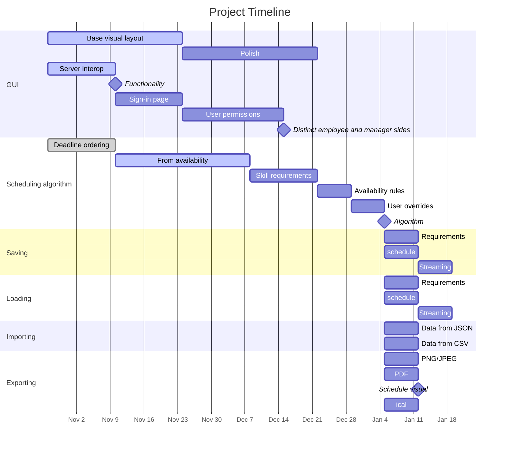
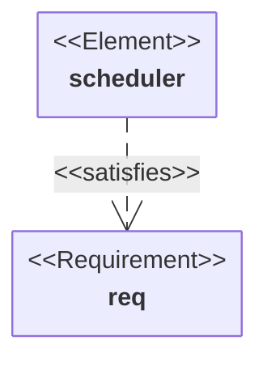
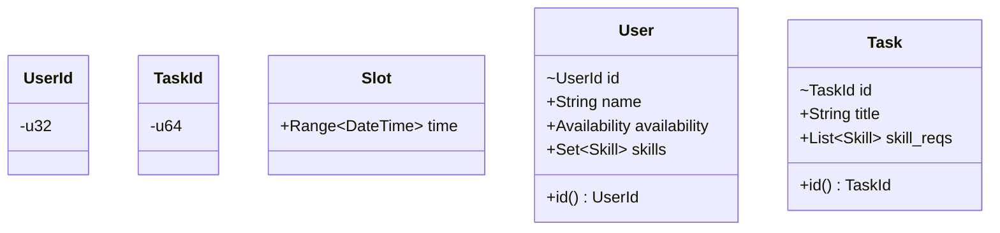

# Gantt

```mermaid
gantt
    title Project Timeline
    dateFormat M-D
    axisFormat %b %e
    tickInterval 1week
    weekday monday
    todayMarker on

    section GUI
        Base visual layout                   : active, g1, 10-27, 4w
        Polish                               : g5, after g1, 4w
        Server interop                       : active, g2, 10-27, 2w
        Functionality                        : milestone, g2
        Sign-in page                         : g3, after g2, 2w
        User permissions                     : g4, after g3, 3w
        Distinct employee and manager sides  : milestone, g3 g4

    section Scheduling algorithm
        Deadline ordering   : done, sch1, 10-27, 2w
        From availability   : active, sch2, after sch1, 4w
        Skill requirements  : sch3, after sch2, 2w
        Availability rules  : sch4, after sch3, 1w
        User overrides      : sch5, after sch4, 1w
        Algorithm           : milestone, sch1 sch2 sch3 sch4 sch5

    section Saving
        Requirements  : ser1, after sch1 sch2 sch3 sch4 sch5, 1w
        schedule      : ser2, after sch1 sch2 sch3 sch4 sch5, 1w
        Streaming     : ser3, after ser2, 1w

    section Loading
        Requirements  : de1, after sch1 sch2 sch3 sch4 sch5, 1w
        schedule      : de2, after sch1 sch2 sch3 sch4 sch5, 1w
        Streaming     : de3, after de2, 1w

    section Importing
        Data from JSON  : im1, after sch1 sch2 sch3 sch4 sch5, 1w
        Data from CSV   : im2, after sch1 sch2 sch3 sch4 sch5, 1w

    section Exporting
        PNG/JPEG           : ex3, after sch1 sch2 sch3 sch4 sch5, 1w
        PDF                : ex4, after sch1 sch2 sch3 sch4 sch5, 1w
        Schedule visual    : milestone, after ex4
        ical               : ex5, after sch1 sch2 sch3 sch4 sch5, 1w
```

# Requirements

```mermaid
requirementDiagram

requirement req {

}

element scheduler {

}

scheduler - satisfies -> req
```

# Flowchart

```mermaid
flowchart TD

    start@{shape: start}
    -->
    uom[user vs manager]@{shape: decision}
    uom --> manager --> generate
    uom --> user --> availability@{shape: manual-input}
```

# Components

```mermaid
classDiagram
    class UserId {
        -u32
    }
    class TaskId {
        -u64
    }
    class Slot {
        +Range~DateTime~ time
    }
    class User {
        ~UserId id
        +String name
        +Availability availability
        +Set~Skill~ skills
        +id() UserId
    }
    class Task {
        ~TaskId id
        +String title
        +List~Skill~ skill_reqs
        +id() TaskId
    }
```
