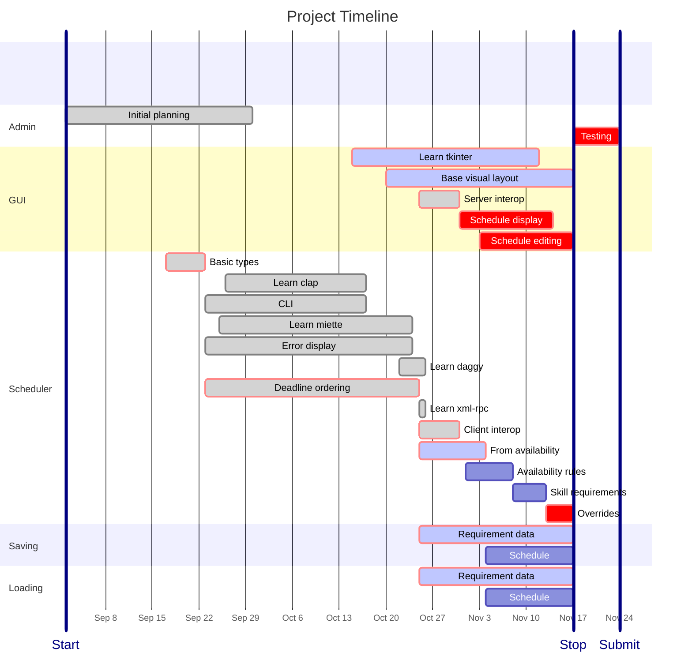
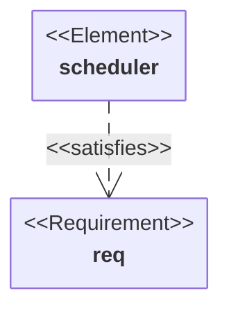
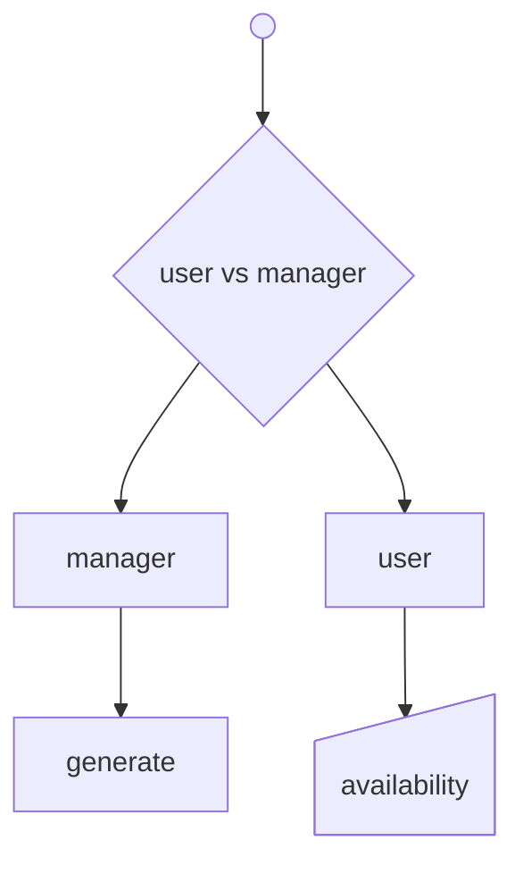
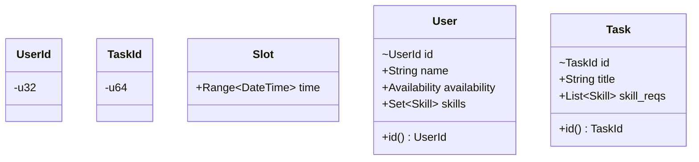

# Gantt

```mermaid
gantt
    title Project Timeline
    dateFormat YYYY-M-D
    axisFormat %b %e
    tickInterval 1week
    weekday monday
    todayMarker on
    Start                                   : vert, 2025-9-2, 0d
    Stop                                    : vert, 2025-11-17, 0d
    Submit                                  : vert, 2025-11-24, 0d

    section Admin
    Initial planning                        : done, plan-init, 2025-9-2, 4w
    Testing                                 : crit, 2025-11-17, 1w

    section GUI
    Learn tkinter                           : crit, active, lrn-tk, 2025-10-15, 4w
    Base visual layout                      : crit, active, base-layout, 2025-10-20, 4w
    Server interop                          : crit, done, interop-clt, 2025-10-25, 2025-10-31
    Schedule display                        : crit, sch-disp, 2025-10-31, 2w
    Schedule editing                        : crit, sch-edit, 2025-11-3, 2w

    section Scheduler
    Basic types                             : crit, done, tys, 2025-9-17, 2025-9-23
    Learn clap                              : done, 2025-9-26, 2025-10-17
    CLI                                     : done, cli, 2025-9-23, 2025-10-17
    Learn miette                            : done, 2025-9-25, 2025-10-24
    Error display                           : done, errs, 2025-9-23, 2025-10-24
    Learn daggy                             : done, 2025-10-22, 2025-10-26
    Deadline ordering                       : crit, done, dl-ord, 2025-9-23, 2025-10-25
    Learn xml-rpc                           : done, 2025-10-25, 1d
    Client interop                          : crit, done, interop-srv, 2025-10-25, 2025-10-31
    From availability                       : crit, active, alg-avail, after dl-ord, 10d
    Availability rules                      : avail-rules, 2025-11-1, 1w
    Skill requirements                      : skill-req, after avail-rules, 5d
    Overrides                               : crit, ovr, after skill-req, 4d

    section Saving
    Requirement data                        : crit, active, ser-dat, after dl-ord, 2025-11-17
    Schedule                                : ser-sch, after alg-avail, 2025-11-17

    section Loading
    Requirement data                        : crit, active, de-dat, after dl-ord, 2025-11-17
    Schedule                                : de-sch, after alg-avail, 2025-11-17
```

# Requirements

```mermaid
requirementDiagram

requirement req {

}

element scheduler {

}

scheduler - satisfies -> req
```

# Flowchart

```mermaid
flowchart TD

    start@{shape: start}
    -->
    uom[user vs manager]@{shape: decision}
    uom --> manager --> generate
    uom --> user --> availability@{shape: manual-input}
```

# Components

```mermaid
classDiagram
    class UserId {
        -u32
    }
    class TaskId {
        -u64
    }
    class Slot {
        +Range~DateTime~ time
    }
    class User {
        ~UserId id
        +String name
        +Availability availability
        +Set~Skill~ skills
        +id() UserId
    }
    class Task {
        ~TaskId id
        +String title
        +List~Skill~ skill_reqs
        +id() TaskId
    }
```
