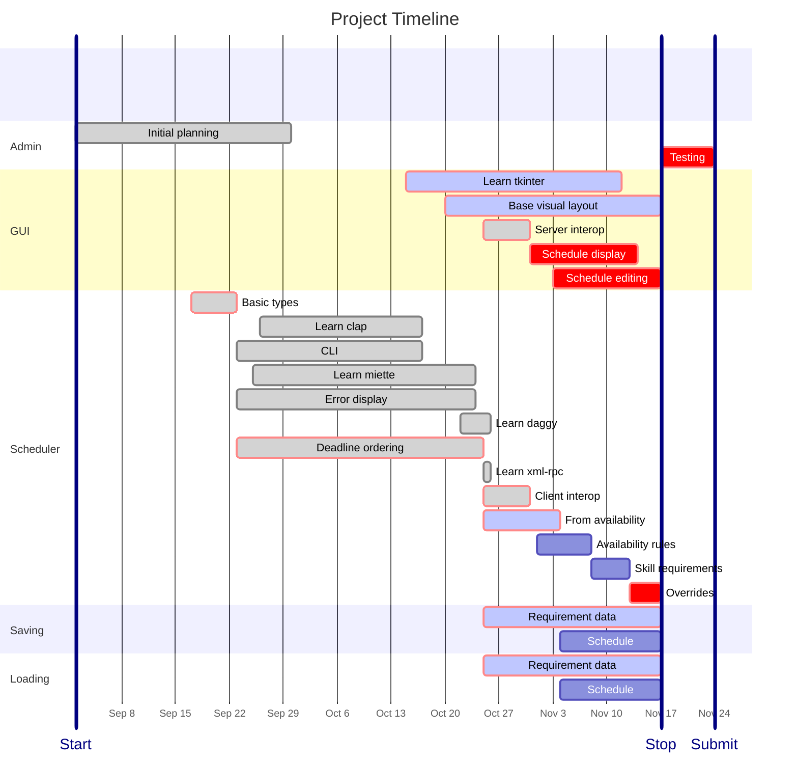
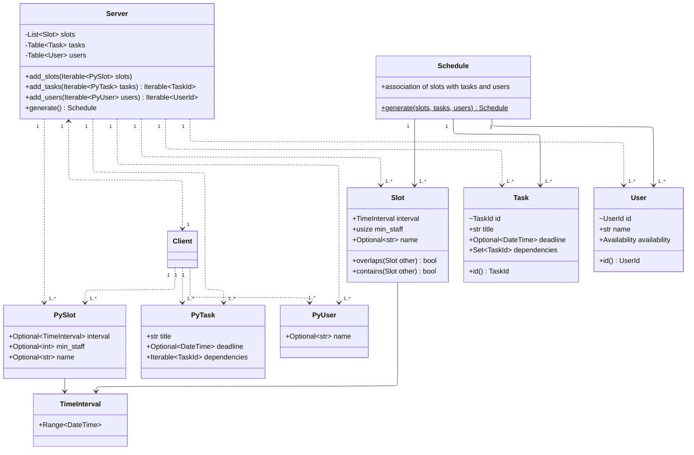
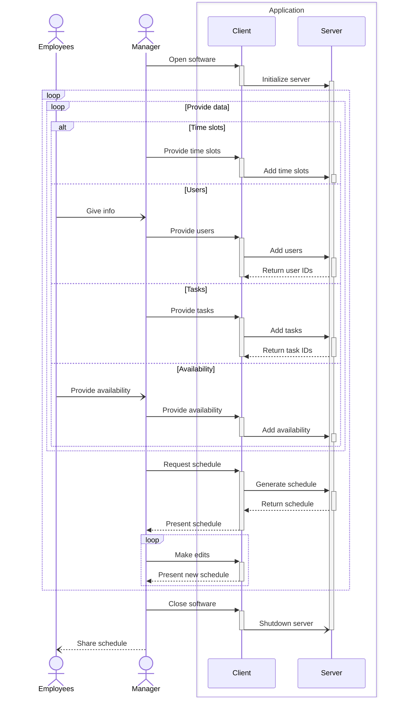

# Gantt

```mermaid
gantt
    title Project Timeline
    dateFormat YYYY-M-D
    axisFormat %b %e
    tickInterval 1week
    weekday monday
    todayMarker on
    Start                                   : vert, 2025-9-2, 0d
    Stop                                    : vert, 2025-11-17, 0d
    Submit                                  : vert, 2025-11-24, 0d

    section Admin
    Initial planning                        : done, plan-init, 2025-9-2, 4w
    Testing                                 : crit, 2025-11-17, 1w

    section GUI
    Learn tkinter                           : crit, active, lrn-tk, 2025-10-15, 4w
    Base visual layout                      : crit, active, base-layout, 2025-10-20, 4w
    Server interop                          : crit, done, interop-clt, 2025-10-25, 2025-10-31
    Schedule display                        : crit, sch-disp, 2025-10-31, 2w
    Schedule editing                        : crit, sch-edit, 2025-11-3, 2w

    section Scheduler
    Basic types                             : crit, done, tys, 2025-9-17, 2025-9-23
    Learn clap                              : done, 2025-9-26, 2025-10-17
    CLI                                     : done, cli, 2025-9-23, 2025-10-17
    Learn miette                            : done, 2025-9-25, 2025-10-24
    Error display                           : done, errs, 2025-9-23, 2025-10-24
    Learn daggy                             : done, 2025-10-22, 2025-10-26
    Deadline ordering                       : crit, done, dl-ord, 2025-9-23, 2025-10-25
    Learn xml-rpc                           : done, 2025-10-25, 1d
    Client interop                          : crit, done, interop-srv, 2025-10-25, 2025-10-31
    From availability                       : crit, active, alg-avail, after dl-ord, 10d
    Availability rules                      : avail-rules, 2025-11-1, 1w
    Skill requirements                      : skill-req, after avail-rules, 5d
    Overrides                               : crit, ovr, after skill-req, 4d

    section Saving
    Requirement data                        : crit, active, ser-dat, after dl-ord, 2025-11-17
    Schedule                                : ser-sch, after alg-avail, 2025-11-17

    section Loading
    Requirement data                        : crit, active, de-dat, after dl-ord, 2025-11-17
    Schedule                                : de-sch, after alg-avail, 2025-11-17
```

# Class Diagram

```mermaid
---
config:
  layout: elk
---
classDiagram
    class TimeInterval {
        +Range~DateTime~
    }
    class Client {
    }
    class Server {
        -List~Slot~ slots
        -Table~Task~ tasks
        -Table~User~ users
        +add_slots(Iterable~PySlot~ slots)
        +add_tasks(Iterable~PyTask~ tasks) Iterable~TaskId~
        +add_users(Iterable~PyUser~ users) Iterable~UserId~
        +generate() Schedule
    }
    Server "1" <..> "1" Client
    Server "1" ..> "1..*" Slot
    Server "1" ..> "1..*" Task
    Server "1" ..> "1..*" User
    Server "1" ..> "1..*" PySlot
    Client "1" ..> "1..*" PySlot
    Server "1" ..> "1..*" PyTask
    Client "1" ..> "1..*" PyTask
    Server "1" ..> "1..*" PyUser
    Client "1" ..> "1..*" PyUser
    class Slot {
        +TimeInterval interval
        +usize min_staff
        +Optional~str~ name
        +overlaps(Slot other) bool
        +contains(Slot other) bool
    }
    Slot --> TimeInterval
    class PySlot {
        +Optional~TimeInterval~ interval
        +Optional~int~ min_staff
        +Optional~str~ name
    }
    PySlot --> TimeInterval
    class Task {
        ~TaskId id
        +str title
        +Optional~DateTime~ deadline
        +Set~TaskId~ dependencies
        +id() TaskId
    }
    class PyTask {

        +str title
        +Optional~DateTime~ deadline
        +Iterable~TaskId~ dependencies
    }
    class User {
        ~UserId id
        +str name
        +Availability availability
        +id() UserId
    }
    class PyUser {
        +Optional~str~ name
    }
    class Schedule {
        +association of slots with tasks and users
        +generate(slots, tasks, users) Schedule$
    }
    Schedule "1" --> "1..*" Slot
    Schedule "1" --> "1..*" Task
    Schedule "1" --> "1..*" User
```

# Sequence Diagram

```mermaid
sequenceDiagram
    actor e as Employees
    actor m as Manager
    box Application
        participant c as Client
        participant s as Server
    end
    m ->>+ c : Open software
    c ->>+ s : Initialize server
    deactivate c
    loop
        loop Provide data
            alt Time slots
                m ->>+ c : Provide time slots
                c ->>+ s : Add time slots
                deactivate c
                deactivate s
            else Users
                e -) m : Give info
                m ->>+ c : Provide users
                c ->>+ s : Add users
                s -->>- c : Return user IDs
                deactivate c
            else Tasks
                m ->>+ c : Provide tasks
                c ->>+ s : Add tasks
                s -->>- c : Return task IDs
                deactivate c
            else Availability
                e -) m : Provide availability
                m ->>+ c : Provide availability
                c ->>+ s : Add availability
                deactivate c
                deactivate s
            end
        end
        m ->>+ c : Request schedule
        c ->>+ s : Generate schedule
        s -->>- c : Return schedule
        c -->>- m : Present schedule
        loop
            m ->>+ c : Make edits
            c -->>- m : Present new schedule
        end
    end
    m ->>+ c : Close software
    c -) s : Shutdown server
    deactivate s
    deactivate c
    m --) e : Share schedule
```
